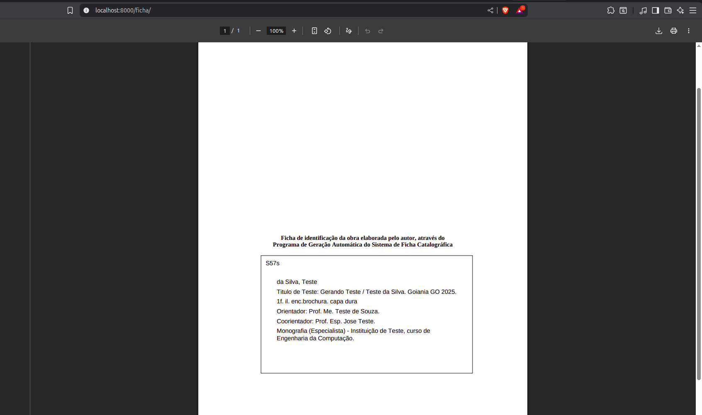

Sistema de Ficha Catalográfica para Bibliotecas
===============================================================
Projeto open source para gerar fichas catalográficas automaticamente para livros e publicações em bibliotecas
utilizando Django e Docker.     

🐧 Linux e Windows — Guia Completo

🚀 Rodando o projeto via Docker (recomendado)

# Pré-requisitos:

Ter Docker e Docker Compose instalados.Verifique se o Docker está instalado.
se já tiver, pule para a seção "Rodando o projeto via Docker".
Abra o terminal e execute:

docker --version

docker-compose version

# Se algum comando falhar, instale o Docker:

Linux (Debian/Ubuntu):

sudo apt update

sudo apt install -y docker.io docker-compose-plugin

sudo systemctl enable --now docker

se der o erro E: Impossível encontrar o pacote docker-compose-plugin
pode ignorar.

sudo usermod -aG docker $USER   # depois faça logout/login

# Rodando o projeto via Docker:
Na raiz do projeto, rode:
docker-compose up --build

ou se quiser rodar em segundo plano e manter o terminal livre:

docker-compose up -d --build

# Aplicar migrações:
docker-compose exec app python manage.py migrate

# Criar superusuário (para acessar /admin):
docker-compose exec app python manage.py createsuperuser

# Parar e remover containers e volumes:
docker-compose down -v

Se a porta 8000 estiver ocupada, edite o docker-compose.yml:
ports:
  - "8080:8000"
docker-compose up --build

Isso cria a imagem, instala dependências e sobe o servidor.
Quando terminar, acesse http://localhost:8000

# Rodando o projeto localmente (sem Docker rodando na venv):

🧩 Pré-requisitos:

Ter Python 3.9+ instalado.

# 1️⃣ Verifique o Python:
python3 --version

# 2️⃣ Crie o ambiente virtual:
python3 -m venv venv

# 3️⃣ Ative o venv:
source venv/bin/activate

# 4️⃣ Atualize o pip e instale as dependências:
pip install --upgrade pip
pip install -r requirements.txt

# 5️⃣ Rode migrações e inicie o servidor:
python manage.py migrate --noinput
python manage.py runserver 0.0.0.0:8000

Acesse em http://localhost:8000

Para sair do ambiente virtual digite no terminal: deactivate

# Imagens de como é o projeto:

